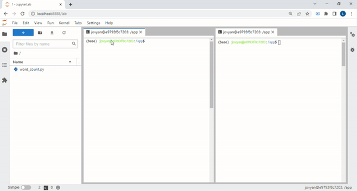

# Aula Spark Structured Streaming

Passos: 

- Execute *docker-compose up -d* para subir o container de spark
- Acesse *localhost:8888*
- Abra 2 terminais:
    - No primeiro: execute *nc -lk 9999* para criar o produtor de dados que enviará informações via rede
    - No segundo: execute *spark-submit word_count.py localhost:9999*

Feito isso, qualquer texto digitado no primeiro terminal irá gerar o micro-batch no spark structured streaming.

Veja o processo em funcionamento:

